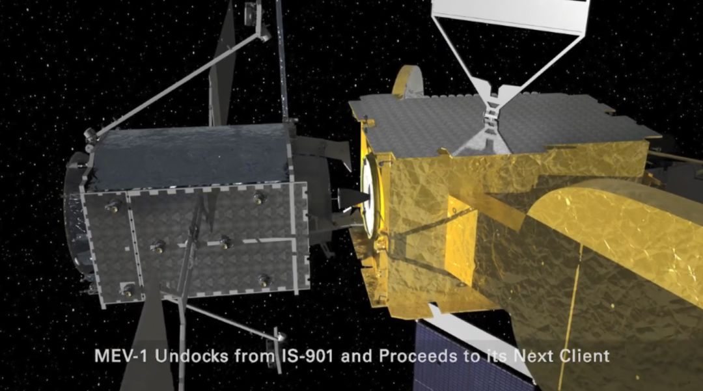
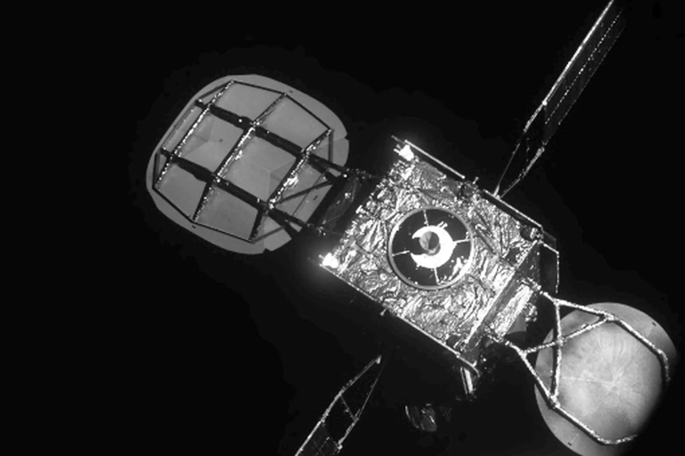
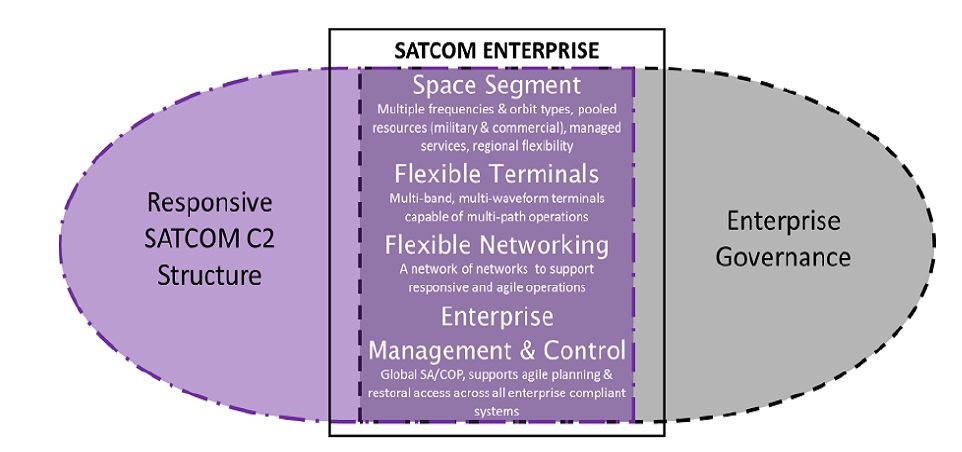
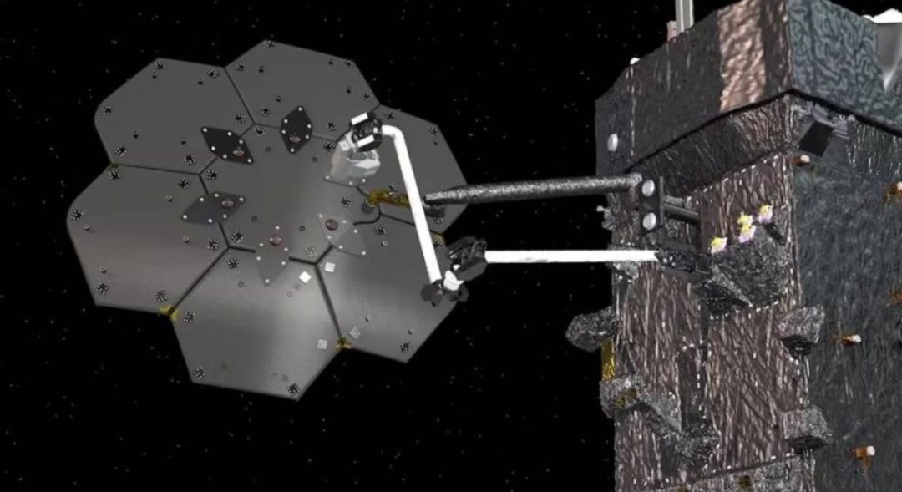
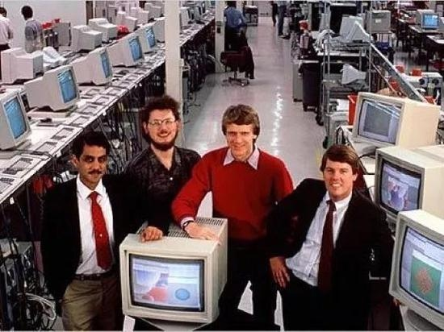
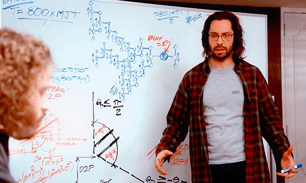

# 每周分享第1期
这里记录过去一周，我看到的值得分享的东西，每周六发布。

## 航天
1、[在轨服务 Satellite Life-Extension Service](https://mp.weixin.qq.com/s?__biz=MzU0NDAyMTUyOQ==&mid=2247490070&idx=1&sn=a0e04bda04fb76c13330f65e8482e0df&chksm=fb03d760cc745e76f253405bba4b3104840204b8674d13a4caa1d1a0f73a25e48927d4a66dc4&mpshare=1&scene=1&srcid=&sharer_sharetime=1582867477110&sharer_shareid=fa2302d864b34bcce23b4ce9de88c6a9#rd)

2020年2月25日，美国所属商业公司的诺格MEV-1飞行器同“国际通信卫星”901实现对接，这是历史上首次与当初设计时并未考虑对接的一颗卫星实现对接，也是首次由两颗商业卫星相互对接，这在世界航天史上算是里程碑事件，意味着在轨服务技术已经成熟，并且商业化运作。第二幅图是从MEV-1拍摄的对接服务对像901，可以看到两边各有一个反射面天线。

Intelsat 901（IS-901）是由美国劳拉公司研制，2001年6月发射入轨，定点在342°E。提供欧洲的Ku波段点波束覆盖范围以及大西洋地区的C波段覆盖范围，设计寿命14年，到今天已服役18年，实际已超期服役4年，这次续了5年命，5年后，一共服役了23年，这5年提供的服务价值应该是大于续命的成本。从某种程度上讲，一颗高轨卫星可以工作23年，这说明卫星各分系统部件经受了极大的空间环境考验。

2、[卫星通信](https://mp.weixin.qq.com/s?__biz=MzU5NTAxOTg1OA==&mid=2247493480&idx=1&sn=990aef248aa71f80d731b35014ad30c7&chksm=fe7af655c90d7f43c96bb24ab3c49f28d104ddaf05f6e74093e48f37132aa056705a732e7d67&mpshare=1&scene=1&srcid=&sharer_sharetime=1582294560434&sharer_shareid=fa2302d864b34bcce23b4ce9de88c6a9#rd)
2020年2月19日，美国太空军发布《卫星通信愿景》文件，正式提出建立一个军商集成的统一卫星通信体系架构，为竞争性、降级或受限通信环境下的作战人员提供卫星通信连接。从图中可以看出，美天空军是从系统组成方面进行了融合设计，包括空间段、终端、网络、地面设施等方面。

从美国通信卫星的可靠性讲，像刚才提到901可以服务达23年之久，那么美国太空军在卫星通信领域融合的速度和难度可想而知。

3、[试验鉴定](https://mp.weixin.qq.com/s?__biz=MzAxMDEzMTI5Mw==&mid=2649805775&idx=1&sn=6b7ba5ca5aff75c7620aebf647f972a7&chksm=835171fdb426f8ebf1e4b7ea253bbcfe4324f229dc2e9900ceef76c018f74a07c2a189380c0d&mpshare=1&scene=1&srcid=&sharer_sharetime=1582153487249&sharer_shareid=fa2302d864b34bcce23b4ce9de88c6a9#rd)
2020年1月31日，美国防部作战试验鉴定主任（DOT&E）发布2019财年年度报告。 
报告主要包含三部分内容：
* 网络安全试验鉴定工作面临的挑战
    * 软件和网络在美国防部作战、训练和业务能力中扮演重要位置。如何通过评估测试系统的弹性方面，提高可实现性面临着挑战。
* 试验鉴定工作取得创新和改进
    * 建立了一个联合仿真环境，用于精准的复现网络安全危害的影响。
* 推动试验鉴定适应国防战略

报告中提到美国防部大量的装备已经实现软件化进程，目的之一就是随着任务需要功能可重构，加快融合的步伐。

4、[在轨组装](https://mp.weixin.qq.com/s?__biz=MzU0NDAyMTUyOQ==&mid=2247489838&idx=1&sn=fb59d3cfd517238f935e75c0e9467ac3&chksm=fb03d458cc745d4e8b28ce0330595c03f878f4cb0aa74d1900258bf7464e92e2d21b35591921&mpshare=1&scene=1&srcid=&sharer_sharetime=1580795495074&sharer_shareid=fa2302d864b34bcce23b4ce9de88c6a9#rd)

据《航天新闻》1月31日报道，麦克萨技术公司1月31日宣布拿到NASA一项1.42亿美元的合同，将验证在天上利用机械臂进行组装的技术。上图为项目设计的卫星反射器阵列在轨组装演示场景。

## 汽车
1、[智能汽车](https://mp.weixin.qq.com/s?__biz=MzI1ODYwOTkzNg==&mid=2247499674&idx=1&sn=6bc5c25206074abf0a844b59993b12ef&chksm=ea0739e5dd70b0f3f561e917e077c07f795f1676fd7d853a10d881b5eef2a10d7f2b60021e3a&mpshare=1&scene=1&srcid=&sharer_sharetime=1582411748460&sharer_shareid=fa2302d864b34bcce23b4ce9de88c6a9#rd)

2月12日，由国家发改委办公厅印发《智能汽车创新发展战略》，文中规划了2025年到2050的中国标准智能汽车体系。智能汽车又称智能网络汽车，汽车工业也在面临着转型升级的考验。

## 数字
1、[空间碎片](https://mp.weixin.qq.com/s?__biz=MzI5NDI3MDExOA==&mid=2247488108&idx=3&sn=be4428b55bab5768959c34b72f15a644&chksm=ec6437a5db13beb3ba171fc0e11e991e297520fcc9900cd33e8ea302995ab04cd6b2dcbe679a&mpshare=1&scene=1&srcid=&sharer_sharetime=1582330299981&sharer_shareid=fa2302d864b34bcce23b4ce9de88c6a9#rd)
据欧洲航天局计算，截止2019年1月，约有3.4万块直径大于10cm的空间碎片，90万块直径在1cm到10cm的空间碎片。

## 人文
1、[北大、武大等七所高校400门人文社科公开课视频（合集）](https://mp.weixin.qq.com/s?__biz=MjM5NjI5ODQyMQ==&mid=2651643814&idx=1&sn=d75dae1c82a0f36e39cae0e34931f2f3&chksm=bd13147c8a649d6ad6e678c5426854efbbf66442c8a562395906159f5a106fb4fdadb2bbaf97&mpshare=1&scene=1&srcid=&sharer_sharetime=1581918963666&sharer_shareid=fa2302d864b34bcce23b4ce9de88c6a9#rd)
疫情笼罩下，有热心网友收集了B站公开的关于人文学科方面的视频。

## 本周博客园热门新闻
1、[微盟程序员因精神原因破坏服务器，公司市值蒸发9亿](https://news.cnblogs.com/n/656325/)

    对公司来说，管理需要提升；对个人来说，也是无可奈何，有句话分享“员工也是客户”

2、[狂赚1200亿，差点收购苹果，那个叫太阳的公司却陨落了](https://news.cnblogs.com/n/656425/)

    图片是四个创始人，Sun 公司，曾是 IT 史上一个不可磨灭的存在。对公司来说，与时俱进，对个人来说，没有一个稳定的平台是永恒的。

3、[汇桔网被曝拖欠12月工资至今，强制买产品，CEO称去年交易额400亿](https://news.cnblogs.com/n/656203/)
　　据了解，汇桔网成立于 2013 年，是汇桔集团旗下的知识产权与企业服务科创平台。员工和公司是命运共同体，不要相互伤害啊！

## Github趋势前五
1、[Virtual machines for iOS](https://github.com/utmapp/UTM)

运行在iOS 的全功能虚拟机主机。 简而言之，它可以让你在你的 iPhone 和 iPad 上运行 Windows，Android 以及其他操作系统。

2、[coding-interview-university](https://github.com/jwasham/coding-interview-university)

A complete computer science study plan to become a software engineer.

3、[kbone](https://github.com/Tencent/kbone)

一个致力于微信小程序和 Web 端同构的解决方案

4、[COVID-19](https://github.com/CSSEGISandData/COVID-19)

这是2019年新型冠状病毒视觉仪表盘的数据库，由约翰·霍普金斯大学系统科学与工程中心运营，数据来源于各国政府部门。

5、[lede](https://github.com/coolsnowwolf/lede)
中文：如何编译自己需要的 OpenWrt 固件

## 名句
1、至于担当大事，全在明强二字。《中庸》学、问、思、辨、行五者，其要归于思必明，柔必强。凡事非气不举，非刚不济，即修身齐家，亦须以明强为本。    --曾国藩

2、坚持均衡的发展思想，合理把握解决各种矛盾的灰度。--任正非

